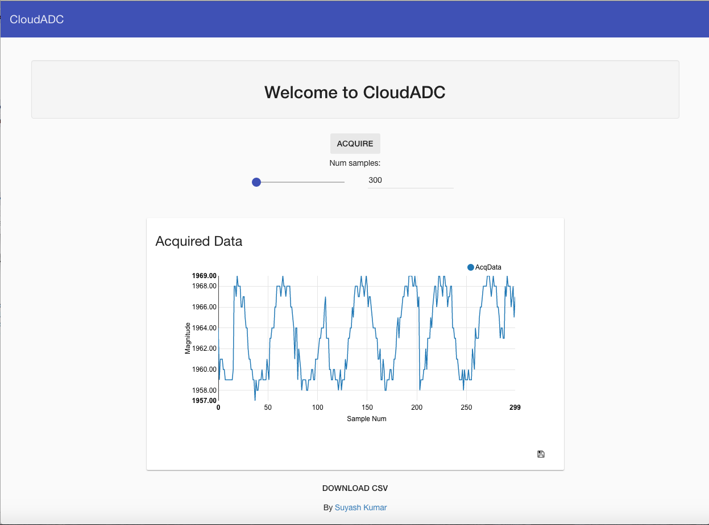

#CloudADC

A highspeed (~1.8MHz) beaglebone based ADC exposed via a web interface. ADC data is collected from the built in BeagleBone ADC at high speeds using the realtime PRU standalone processor core(s) and relayed via a restful API route (`/api/data`) to clients. 

